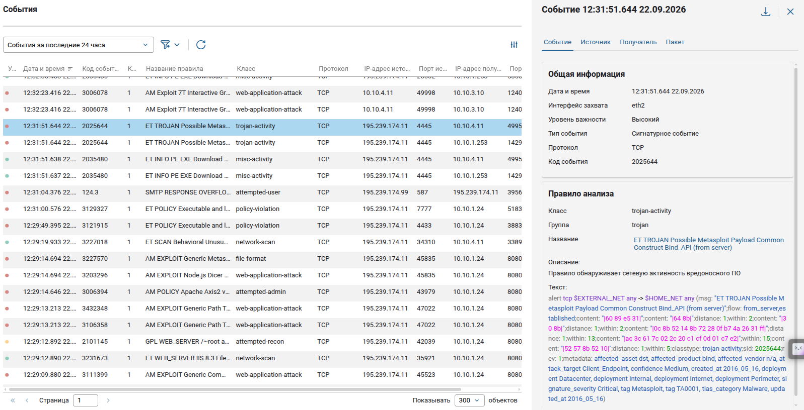
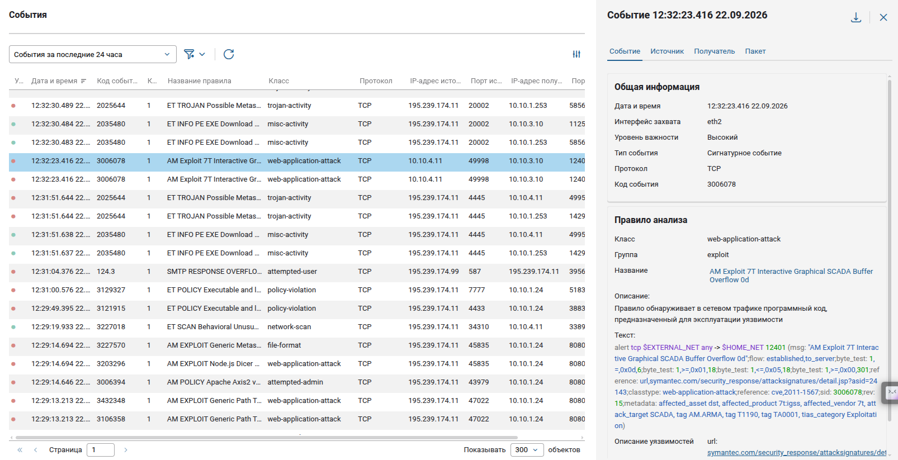
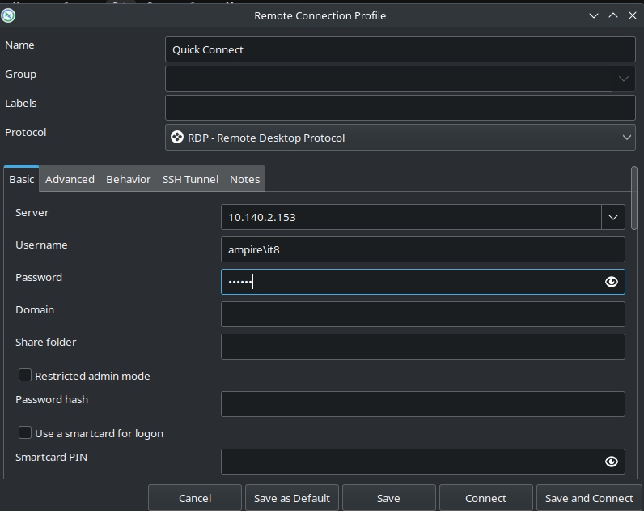
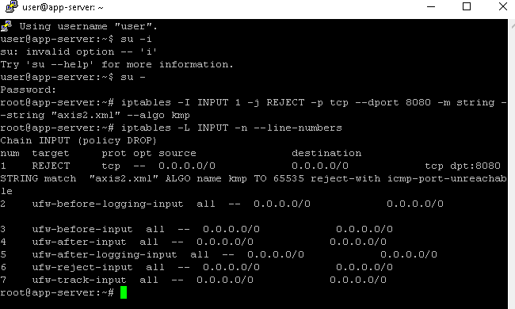
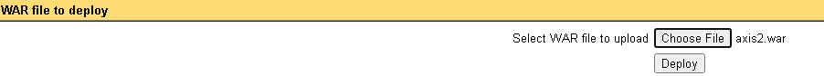
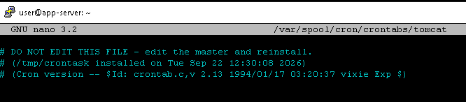
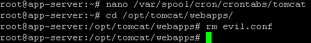
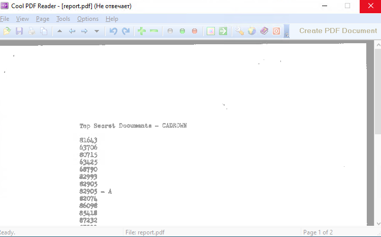
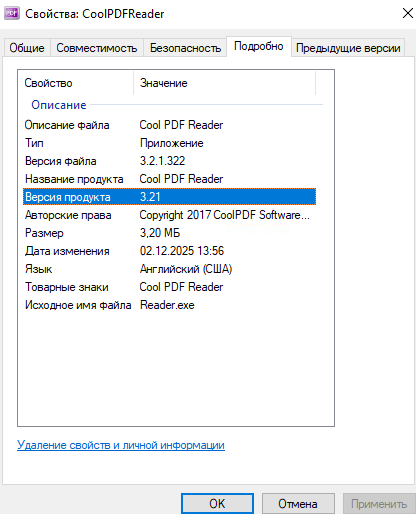
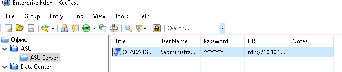

---
# Preamble

## Author
author:
  name: Бызова Мария Олеговна, Верниковская Екатерина Андреевна, Богаткина Алена Александровна, Сущенко Алина Николаевна, Калашникова Ольга Сергеевна, Абдуллахи Бахара
  degrees: DSc
  email: 11322361366@pfur.ru
  affiliation:
    - name: Российский университет дружбы народов
      country: Российская Федерация
      postal-code: 117198
      city: Москва
      address: ул. Миклухо-Маклая, д. 6

## Title
title: Лабораторная работа №1
subtitle: Кибербезопасность предприятия
license: CC BY
date: 2026-09-22

## Generic options
lang: ru-RU
crossref:
  lof-title: Список иллюстраций
  lot-title: Список таблиц
  lol-title: Листинги

## Fonts 
mainfont: PT Serif 
romanfont: PT Serif 
sansfont: PT Sans 
monofont: PT Mono 
mainfontoptions: Ligatures=TeX 
romanfontoptions: Ligatures=TeX 
sansfontoptions: Ligatures=TeX,Scale=MatchLowercase 
monofontoptions: Scale=MatchLowercase,Scale=0.9

## Formats
format:
### Pdf output format
  beamer:
    toc: true
    toc-title: Содержание
    number-sections: true
    colorlinks: false
    toc-depth: 2
    slide_level: 2
    aspectratio: 169
    section-titles: true
    theme: metropolis
    themeoptions: progressbar=frametitle,sectionpage=progressbar,numbering=fraction
    pdf-engine: xelatex
    fontenc: T2A
#### Language
    babel-lang: russian
    babel-otherlangs: english

### Html output
  revealjs:
    transition: slide
    margin: 0.2
    smaller: false
    output-ext: html
    theme: beige
    logo: _resources/image/logo_rudn.png
---

# Вводная часть

## Цель работы

Изучить сценарий действий нарушителя в рамках защиты данных сегмента АСУ ТП, а также освоить методы выявления и устранения уязвимостей и их последствий.

## Выявленные уязвимости и последствия

В ходе выполнения лабораторной работы были выявлены следующие уязвимости и их последствия:

**Уязвимость 1.** Уязвимая версия axis2 (CVE-2010-0219)

**Последствие.** App Backdoor

**Уязвимость 2.** Уязвимая версия программы CoolReaderPDF (CVE-2012-4914)

**Последствие.** Manager meterpreter-сессия

**Уязвимость 3.** Уязвимая версия IGSS (CVE-2011-1567)

**Последствие.** IGSS meterpreter-сессия

# Выполнение лабораторной работы

## Анализ событий в системе мониторинга

{#fig-001 width=70%}

## Анализ событий в системе мониторинга

{#fig-002 width=70%}

## Анализ событий в системе мониторинга
{#fig-003 width=70%}

## Подключение к инфраструктуре и работа с учётными данными

{#fig-004 width=50%}

## Подключение к инфраструктуре и работа с учётными данными

{#fig-006 width=70%}

## Подключение к инфраструктуре и работа с учётными данными

{#fig-007 width=70%}

## Устранение уязвимости axis2

{#fig-008 width=70%}

## Устранение уязвимости axis2
{#fig-009 width=70%}

## Устранение уязвимости axis2

{#fig-010 width=70%}

## Устранение уязвимости axis2

{#fig-011 width=70%}

## Устранение последствия App Backdoor

{#fig-012 width=70%}

## Устранение последствия App Backdoor

{#fig-013 width=70%}

## Устранение последствия App Backdoor

{#fig-015 width=70%}

## Устранение последствия App Backdoor

{#fig-016 width=70%}

## Устранение последствия App Backdoor

{#fig-017 width=70%}

## Устранение уязвимости CoolReaderPDF

{#fig-018 width=70%}

## Устранение уязвимости CoolReaderPDF

{#fig-019 width=50%}

## Устранение уязвимости CoolReaderPDF

{#fig-020 width=50%}

## Устранение уязвимости CoolReaderPDF

{#fig-021 width=70%}

## Устранение уязвимости CoolReaderPDF

{#fig-022 width=40%}

## Устранение последствия Manager meterpreter

{#fig-024 width=50%}

## Устранение уязвимости IGSS

{#fig-025 width=70%}

## Устранение уязвимости IGSS

{#fig-026 width=40%}

## Устранение уязвимости IGSS

{#fig-027 width=40%}

## Устранение последствия IGSS meterpreter

{#fig-028 width=70%}

## Заполнение инцидентов

{#fig-029 width=50%}

## Заполнение инцидентов

{#fig-030 width=60%}

## Заполнение инцидентов

{#fig-031 width=50%}

# Заключение

## Вывод

В ходе выполнения лабораторной работы был изучен сценарий действий нарушителя «Защита данных сегмента АСУ ТП». Были выявлены и успешно устранены уязвимости CVE-2010-0219 (axis2), CVE-2012-4914 (CoolReaderPDF) и CVE-2011-1567 (IGSS), а также нейтрализованы их последствия: App Backdoor, Manager meterpreter-сессия и IGSS meterpreter-сессия. Получены практические навыки работы с системой мониторинга событий, менеджером паролей KeePass, настройкой брандмауэра и устранением вредоносных соединений.

## Список литературы {.unnumbered}

::: {#refs}
:::
