---
## Front matter
title: "Лабораторная работа №1"
subtitle: "Кибербезопасность предприятия"
author: 
- Бызова Мария Олеговна
- Верниковская Екатерина Андреевна
- Богаткина Алена Александровна
- Сущенко Алина Николаевна
- Калашникова Ольга Сергеевна
- Абдуллахи Бахара
license: "CC BY"
---

# Цель работы

Изучить сценарий действий нарушителя в рамках защиты данных сегмента АСУ ТП, а также освоить методы выявления и устранения уязвимостей и их последствий.

# Выявленные уязвимости и последствия

В ходе выполнения лабораторной работы были выявлены следующие уязвимости и их последствия:

**Уязвимость 1.** Уязвимая версия axis2 (CVE-2010-0219)

**Последствие.** App Backdoor

**Уязвимость 2.** Уязвимая версия программы CoolReaderPDF (CVE-2012-4914)

**Последствие.** Manager meterpreter-сессия

**Уязвимость 3.** Уязвимая версия IGSS (CVE-2011-1567)

**Последствие.** IGSS meterpreter-сессия

## Анализ событий в системе мониторинга

На первом этапе работы был проведён анализ событий информационной безопасности. В интерфейсе системы мониторинга был выполнен просмотр журнала событий за последние 24 часа. Среди зафиксированных событий особое внимание привлекло событие с кодом 3006394, относящееся к правилу «AM POLICY Apache Axis2 v1.6 Default Admin Credential (CVE-2010-0219)». Данное событие классифицируется как попытка нарушения политики безопасности (attempted-admin) и свидетельствует о попытке эксплуатации уязвимости, связанной с использованием учётных данных администратора по умолчанию в Apache Axis2. В деталях события указан источник (195.239.174.11) и получатель (10.10.1.24), а также приведён текст сигнатуры, описывающей признак компрометации ([рис. @fig-001]).

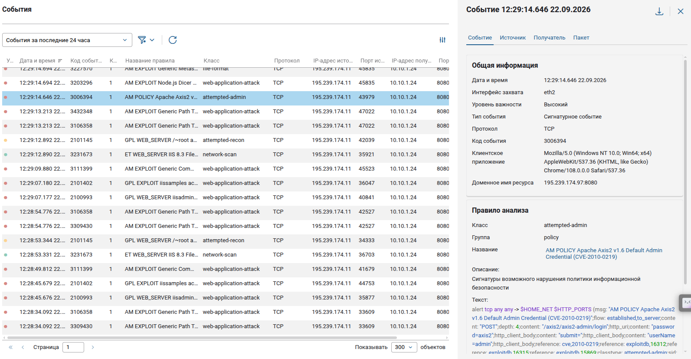{#fig-001 width=70%}

Далее был продолжен анализ журнала событий. Было обнаружено событие с кодом 2025644, классифицируемое как «ET TROJAN Possible Metasploit Payload Common Construct Bind_API (from server)». Данное событие относится к категории активности трояна (trojan-activity) и указывает на возможную передачу полезной нагрузки Metasploit между узлами 195.239.174.11 и 10.10.4.11, а также 10.10.1.253. Наличие подобного события подтверждает факт компрометации узлов и установления обратного соединения с инфраструктурой нарушителя ([рис. @fig-002]).

{#fig-002 width=70%}

В ходе дальнейшего анализа было выявлено событие с кодом 3006078, соответствующее правилу «AM Exploit 7T Interactive Graphical SCADA Buffer Overflow 0d». Это событие относится к классу web-application-attack и свидетельствует об эксплуатации уязвимости переполнения буфера в программном обеспечении Interactive Graphical SCADA. Источником атаки выступает узел 10.10.4.11, а целью — 10.10.3.10 (SCADA Server). Данное событие подтверждает факт проведения атаки на сегмент АСУ ТП  ([рис. @fig-003]).

{#fig-003 width=70%}

## Подключение к инфраструктуре и работа с учётными данными

Для выполнения дальнейших действий было выполнено подключение к удалённому рабочему столу. В окне Remote Connection Profile был настроен профиль подключения с протоколом RDP. В качестве сервера указан адрес 10.140.2.153, имя пользователя — ```ampire\it8```. После ввода пароля было выполнено подключение  ([рис. @fig-004]).

{#fig-004 width=70%}

После успешного входа в систему был открыт менеджер паролей KeePass. Для доступа к базе данных Enterprise.kdbx потребовалось ввести мастер-пароль. В окне Open Database был введён мастер-пароль, после чего база данных была разблокирована ([рис. @fig-006]).

{#fig-006 width=70%}

В открытой базе данных KeePass был выполнен поиск учётных данных для подключения к серверу Apache Tomcat. В разделе DMZ была найдена запись «Apache Tomcat», содержащая имя пользователя и пароль для доступа. Также в базе присутствуют записи для других узлов инфраструктуры, включая SCADA IGSS  ([рис. @fig-007]).

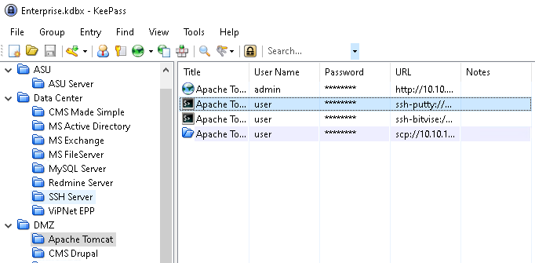{#fig-007 width=70%}

## Устранение уязвимости axis2

Для устранения уязвимости CVE-2010-0219 было выполнено подключение к серверу app-server по SSH. В терминале был выполнен вход под пользователем root с помощью команды su. Затем было добавлено правило в iptables, блокирующее доступ к конфигурационному файлу axis2.xml через порт 8080. Команда имеет вид: iptables -I INPUT 1 -j REJECT -p tcp --dport 8080 -m string --string "axis2.xml" --algo kmp. После добавления правила был выполнен просмотр списка правил с помощью команды iptables -L INPUT -n --line-numbers, который подтвердил успешное добавление правила  ([рис. @fig-008]).

{#fig-008 width=70%}

Далее был выполнен переход на веб-интерфейс сервера Apache Tomcat по адресу http://10.10.1.24:8080. На стартовой странице отображается информация об успешной установке Tomcat версии 9.0.29. Для управления приложениями была нажата кнопка «Manager App» ([рис. @fig-009]).

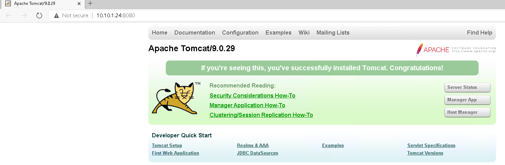{#fig-009 width=70%}

В интерфейсе Tomcat Web Application Manager был выполнен вход под учётной записью администратора. В таблице Applications отображается приложение «Apache-Axis2», которое находится в состоянии Running. Для удаления уязвимого приложения была нажата кнопка «Undeploy» ([рис. @fig-010]).

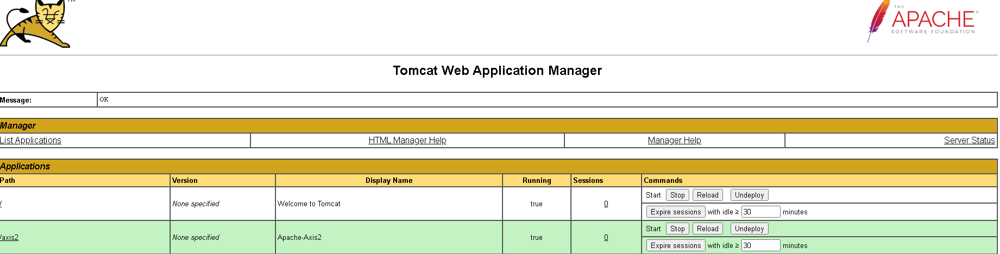{#fig-010 width=70%}

После удаления уязвимой версии axis2 был загружен актуальный WAR-файл. В разделе «WAR file to deploy» было выбрано действие «Choose File», после чего был указан файл axis2.war. Для развёртывания приложения была нажата кнопка «Deploy» ([рис. @fig-011]).

{#fig-011 width=70%}

## Устранение последствия App Backdoor

Для выявления активных сессий с машиной нарушителя была выполнена команда sudo ss -tp. В выводе команды обнаружено установленное соединение с IP-адресом 195.239.174.11 через порт 7777, связанное с процессом evil.conf. Это подтверждает наличие обратного соединения (reverse shell), установленного вредоносным файлом ([рис. @fig-012]).

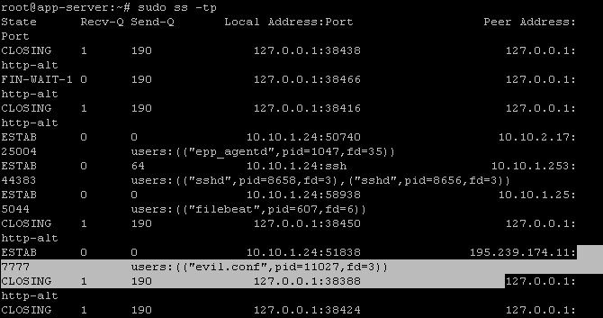{#fig-012 width=70%}

В системном журнале /var/log/syslog было обнаружено событие автозапуска вредоносного файла. Запись свидетельствует о том, что cron выполнил запуск файла /opt/tomcat/webapps/evil.conf от имени пользователя tomcat. Таким образом, было подтверждено наличие механизма автозапуска backdoor ([рис. @fig-013]).

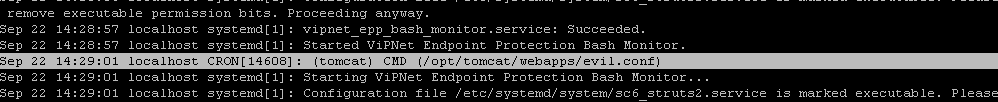{#fig-013 width=70%}

Для устранения автозапуска был открыт файл crontab пользователя tomcat по пути /var/spool/cron/crontabs/tomcat с помощью редактора nano. В файле была обнаружена строка, запускающая evil.conf каждую минуту. После редактирования файл crontab был сохранён. Содержимое файла подтверждает, что строка автозапуска вредоносного файла удалена, и механизм автозапуска отключён ([рис. @fig-015]).

{#fig-015 width=70%}

Далее был выполнен переход в директорию /opt/tomcat/webapps/ и удаление вредоносного файла evil.conf с помощью команды rm. Таким образом, исполняемый файл backdoor был удалён с сервера ([рис. @fig-016]).

{#fig-016 width=70%}

Для завершения всех активных сессий с машиной нарушителя была выполнена команда kill с идентификатором процесса 11027. В результате выполнения команды вредоносный процесс был завершён, и соединение с нарушителем разорвано ([рис. @fig-017]).

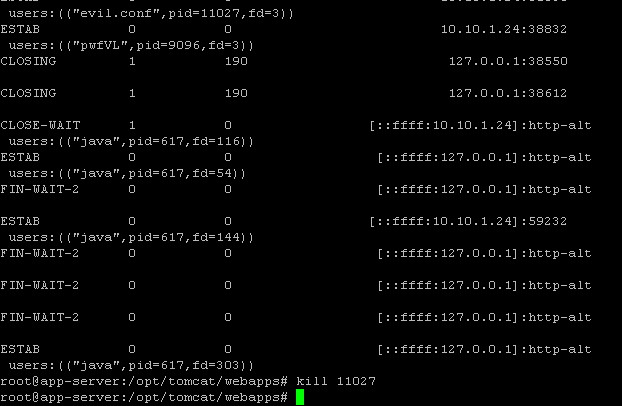{#fig-017 width=70%}

## Устранение уязвимости CoolReaderPDF

На хосте Manager Workstation 1 была открыта программа Cool PDF Reader, в которой был открыт файл report.pdf. Данный файл содержит специально сгенерированное содержимое, вызывающее переполнение стека при просмотре. При открытии документа отображается содержимое ([рис. @fig-018]).

{#fig-018 width=70%}

Для устранения уязвимости был открыт менеджер паролей KeePass, в котором была найдена учётная запись для подключения к Manager Workstation 1. ([рис. @fig-019]).

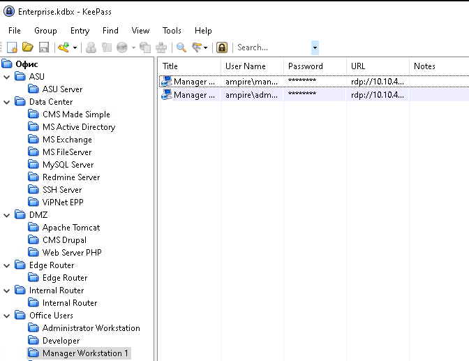{#fig-019 width=70%}

В окне монитора брандмауэра Windows в режиме повышенной безопасности было создано правило для исходящих подключений, блокирующее трафик от приложения CoolPDFReader. Данное правило отображается в списке правил для исходящего подключения ([рис. @fig-020]).

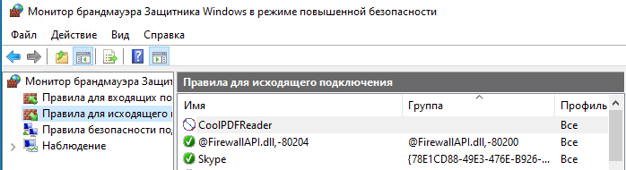{#fig-020 width=70%}

Аналогичным образом было создано правило для входящих подключений, также блокирующее трафик от приложения CoolPDFReader. Правило отображается в списке правил для входящих подключений ([рис. @fig-021]).

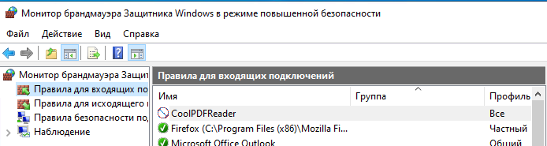{#fig-021 width=70%}

Для полного устранения уязвимости версия CoolPDFReader была обновлена до последней ([рис. @fig-022]).

{#fig-022 width=70%}

## Устранение последствия Manager meterpreter

Для выявления активных соединений с машиной нарушителя была выполнена команда netstat -bno. В выводе команды обнаружено установленное соединение процесса CoolPDFReader.exe с IP-адресом 195.239.174.11 через порт 4445. Идентификатор процесса (PID) — 7960. Это подтверждает наличие активной сессии meterpreter. Для устранения полезной нагрузки была выполнена команда taskkill /f /pid 7960, которая принудительно завершила процесс с указанным идентификатором. В результате выполнения команды процесс был успешно завершён, и соединение с нарушителем разорвано ([рис. @fig-024]).

{#fig-024 width=70%}

## Устранение уязвимости IGSS

Для устранения уязвимости CVE-2011-1567 был открыт менеджер паролей KeePass, в котором была найдена учётная запись для подключения к SCADA IGSS.([рис. @fig-025]).

{#fig-025 width=70%}

В окне брандмауэра Windows была включена защита. На вкладке «Общие» выбран режим «Включить (рекомендуется)», а также установлена галочка «Не разрешать исключения». Данные настройки блокируют все внешние подключения, кроме выбранных в исключениях ([рис. @fig-026]).

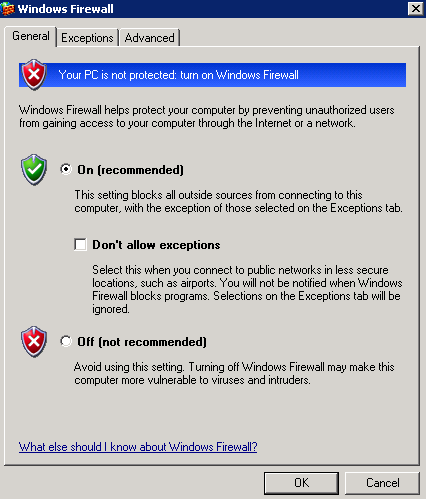{#fig-026 width=70%}

На вкладке «Исключения» были просмотрены программы и службы, для которых разрешено исключение. В списке присутствуют компоненты IGSS, включая IGSS DataServer. Для устранения уязвимости необходимо убрать галочки с исключений IGSS ([рис. @fig-027]).

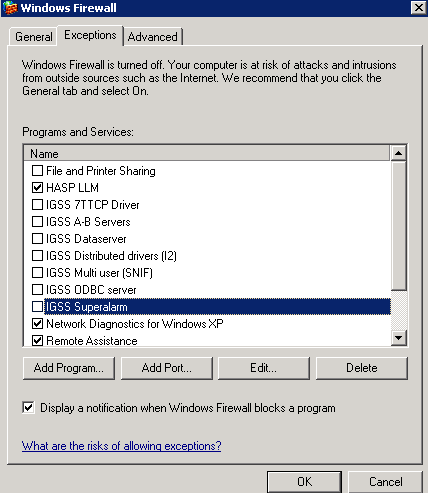{#fig-027 width=70%}

## Устранение последствия IGSS meterpreter

Для выявления активных соединений с машиной нарушителя была выполнена команда netstat -bno. В выводе команды обнаружено установленное соединение процесса IGSSdataServer.exe с IP-адресом 195.239.174.11 через порт 20002. Идентификатор процесса (PID) — 744. Это подтверждает наличие активной сессии meterpreter на узле SCADA Server ([рис. @fig-028]). Для устранения полезной нагрузки была выполнена команда taskkill /f /pid 744, которая принудительно завершила процесс с указанным идентификатором. В результате выполнения команды процесс был успешно завершён, и соединение с нарушителем разорвано ([рис. @fig-028]).

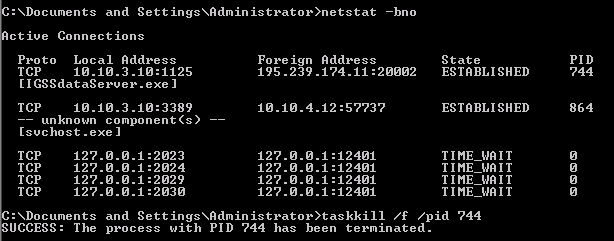{#fig-028 width=70%}

## Заполнение инцидентов

В системе обработки инцидентов было выполнено добавление инцидента, связанного с уязвимостью axis2. ([рис. @fig-029]).

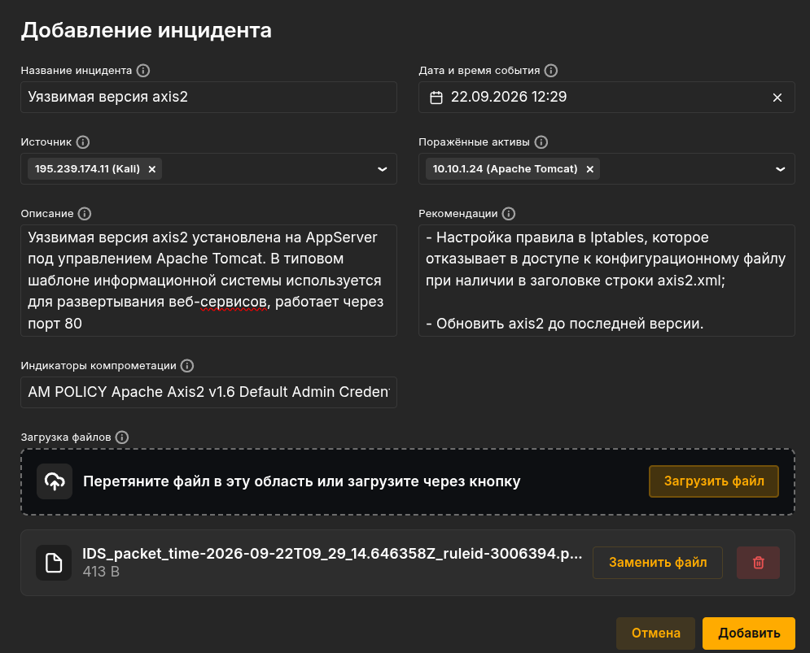{#fig-029 width=70%}

В системе обработки инцидентов было выполнено добавление инцидента, связанного с уязвимостью CoolPDFReader. ([рис. @fig-030]).

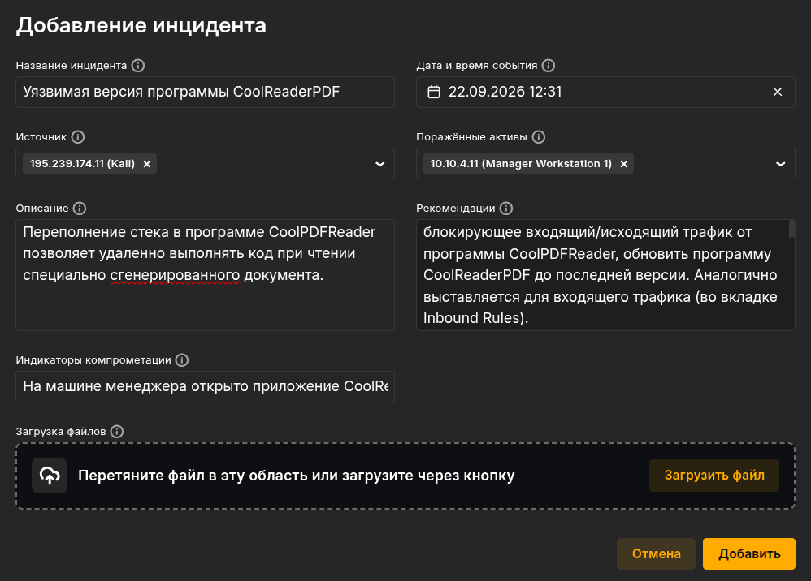{#fig-030 width=70%}

В системе обработки инцидентов было выполнено добавление инцидента, связанного с уязвимостью IGSS. ([рис. @fig-031]).

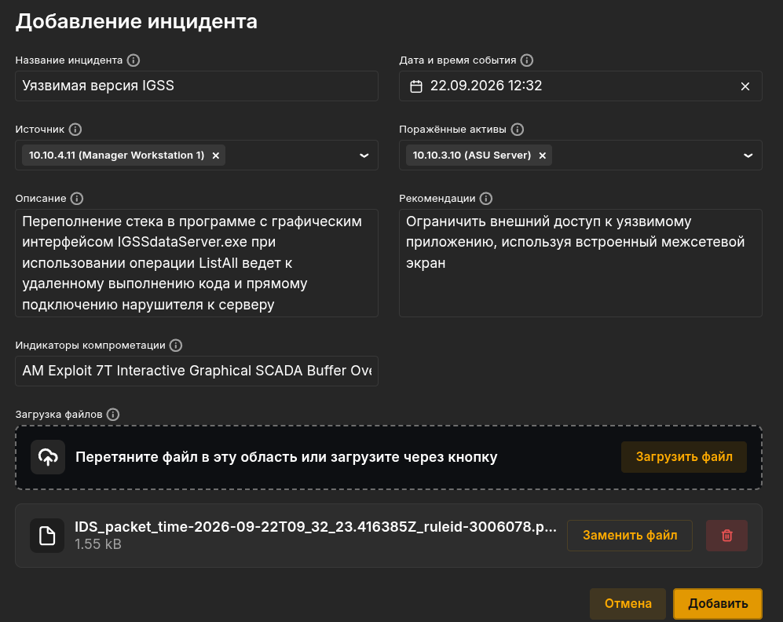{#fig-031 width=70%}


# Вывод

В ходе выполнения лабораторной работы был изучен сценарий действий нарушителя «Защита данных сегмента АСУ ТП». Были выявлены и успешно устранены уязвимости CVE-2010-0219 (axis2), CVE-2012-4914 (CoolReaderPDF) и CVE-2011-1567 (IGSS), а также нейтрализованы их последствия: App Backdoor, Manager meterpreter-сессия и IGSS meterpreter-сессия. Получены практические навыки работы с системой мониторинга событий, менеджером паролей KeePass, настройкой брандмауэра и устранением вредоносных соединений.

# Список литературы {.unnumbered}

::: {#refs}
:::
