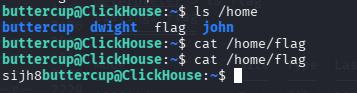
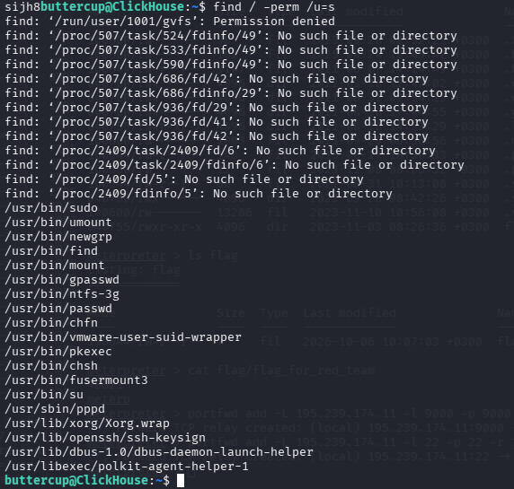
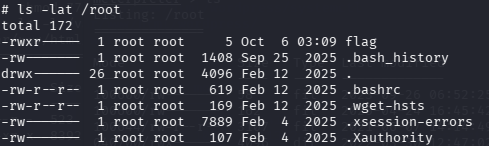
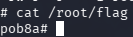

---
# Preamble

## Author
author:
  name: Бызова Мария Олеговна, Верниковская Екатерина Андреевна, Богаткина Алена Александровна, Сущенко Алина Николаевна, Калашникова Ольга Сергеевна, Абдуллахи Бахара
  degrees: DSc
  email: 11322361366@pfur.ru
  affiliation:
    - name: Российский университет дружбы народов
      country: Российская Федерация
      postal-code: 117198
      city: Москва
      address: ул. Миклухо-Маклая, д. 6

## Title
title: Лабораторная работа №2
subtitle: Кибербезопасность предприятия
license: CC BY
date: 2026-10-06

## Generic options
lang: ru-RU
crossref:
  lof-title: Список иллюстраций
  lot-title: Список таблиц
  lol-title: Листинги

## Fonts 
mainfont: PT Serif 
romanfont: PT Serif 
sansfont: PT Sans 
monofont: PT Mono 
mainfontoptions: Ligatures=TeX 
romanfontoptions: Ligatures=TeX 
sansfontoptions: Ligatures=TeX,Scale=MatchLowercase 
monofontoptions: Scale=MatchLowercase,Scale=0.9

## Formats
format:
### Pdf output format
  beamer:
    toc: true
    toc-title: Содержание
    number-sections: true
    colorlinks: false
    toc-depth: 2
    slide_level: 2
    aspectratio: 169
    section-titles: true
    theme: metropolis
    themeoptions: progressbar=frametitle,sectionpage=progressbar,numbering=fraction
    pdf-engine: xelatex
    fontenc: T2A
#### Language
    babel-lang: russian
    babel-otherlangs: english

### Html output
  revealjs:
    transition: slide
    margin: 0.2
    smaller: false
    output-ext: html
    theme: beige
    logo: _resources/image/logo_rudn.png
---

# Вводная часть

## Цель работы

Целью данной лабораторной работы является получение практических навыков по обнаружению и эксплуатации уязвимостей веб-сервера и сервера аналитики на базе СУБД ClickHouse, а также по повышению привилегий в операционной системе Linux.

## Задачи

Для достижения цели необходимо выполнить следующие задачи:
1.  Провести разведку сети и обнаружить уязвимый веб-сервер.
2.  Эксплуатировать уязвимость в CMS WordPress для получения первоначального доступа.
3.  Повысить привилегии до уровня ```root``` на веб-сервере.
4.  Получить доступ к внутреннему серверу ClickHouse через скомпрометированный веб-сервер.
5.  Извлечь учетные данные из базы данных ClickHouse.
6.  Подключиться к серверу ClickHouse по SSH и повысить привилегии.
7.  Найти все флаги, подтверждающие успешное выполнение этапов.

# Выполнение лабораторной работы

## Подключение к инфраструктуре и работа с учётными данными

{#fig-001 width=40%}

## Атака на веб-сервер (первый этап). Разведка и поиск веб-сервера

{#fig-002 width=70%}

## Атака на веб-сервер (первый этап). Разведка и поиск веб-сервера

{#fig-003 width=70%}

## Атака на веб-сервер (первый этап). Разведка и поиск веб-сервера

{#fig-004 width=40%}

## Атака на веб-сервер (первый этап). Разведка и поиск веб-сервера

{#fig-005 width=70%}

## Атака на веб-сервер (первый этап). Разведка и поиск веб-сервера

{#fig-006 width=70%}

## Атака на веб-сервер (первый этап). Разведка и поиск веб-сервера

{#fig-007 width=70%}

## Атака на веб-сервер (первый этап). Разведка и поиск веб-сервера

{#fig-008 width=70%}

## Атака на веб-сервер (первый этап). Разведка и поиск веб-сервера

{#fig-009 width=70%}

## Атака на веб-сервер (первый этап). Эксплуатация уязвимости плагина WpDiscuz

{#fig-010 width=70%}

## Атака на веб-сервер (первый этап). Эксплуатация уязвимости плагина WpDiscuz

{#fig-011 width=40%}

## Атака на веб-сервер (первый этап). Эксплуатация уязвимости плагина WpDiscuz

{#fig-012 width=70%}

## Атака на веб-сервер (первый этап). Эксплуатация уязвимости плагина WpDiscuz

{#fig-013 width=70%}

## Атака на веб-сервер (первый этап). Получение первого флага в /var/www/flag

{#fig-014 width=70%}

## Атака на веб-сервер (первый этап). Локальное повышение привилегий

{#fig-015 width=70%}

## Атака на веб-сервер (первый этап). Локальное повышение привилегий

{#fig-016 width=70%}

## Атака на веб-сервер (первый этап). Локальное повышение привилегий

{#fig-017 width=60%}

## Атака на веб-сервер (первый этап). Локальное повышение привилегий

{#fig-018 width=70%}

## Атака на веб-сервер (первый этап). Локальное повышение привилегий

{#fig-019 width=70%}

## Атака на веб-сервер (первый этап). Локальное повышение привилегий

{#fig-020 width=70%}

## Атака на веб-сервер (первый этап). Локальное повышение привилегий

{#fig-021 width=70%}

## Атака на веб-сервер (первый этап). Локальное повышение привилегий

{#fig-022 width=70%}

## Атака на веб-сервер (первый этап). Локальное повышение привилегий

{#fig-023 width=70%}

## Атака на веб-сервер (первый этап). Локальное повышение привилегий

{#fig-024 width=70%}

## Атака на веб-сервер (первый этап). Локальное повышение привилегий

{#fig-025 width=70%}

## Атака на веб-сервер (первый этап). Локальное повышение привилегий

{#fig-026 width=70%}

## Атака на веб-сервер (первый этап). Локальное повышение привилегий

{#fig-027 width=70%}

## Атака на веб-сервер (первый этап). Получение второго флага в директории /root/flag

{#fig-028 width=70%}

## Атака на сервер аналитики (второй этап). Удаленное подключение к серверу ClickHouse по порту 9000

{#fig-029 width=70%}

## Атака на сервер аналитики (второй этап). Удаленное подключение к серверу ClickHouse по порту 9000

{#fig-030 width=70%}

## Атака на сервер аналитики (второй этап). Удаленное подключение к серверу ClickHouse по порту 9000

{#fig-031 width=70%}

## Атака на сервер аналитики (второй этап). Удаленное подключение к серверу ClickHouse по порту 9000

{#fig-032 width=50%}

## Атака на сервер аналитики (второй этап). Получение третьего флага в БД сервера

{#fig-033 width=70%}

## Атака на сервер аналитики (второй этап). Получение третьего флага в БД сервера

{#fig-034 width=70%}

## Атака на сервер аналитики (второй этап). Удаленное подключение к серверу ClickHouse по порту 22

{#fig-035 width=70%}

## Атака на сервер аналитики (второй этап). Удаленное подключение к серверу ClickHouse по порту 22

{#fig-036 width=70%}

## Атака на сервер аналитики (второй этап). Удаленное подключение к серверу ClickHouse по порту 22

{#fig-037 width=70%}

## Атака на сервер аналитики (второй этап). Удаленное подключение к серверу ClickHouse по порту 22

{#fig-038 width=70%}

## Атака на сервер аналитики (второй этап). Получение четвертого флага в директории /home сервера

{#fig-039 width=70%}

## Атака на сервер аналитики (второй этап). Повышение привилегий

{#fig-040 width=50%}

## Атака на сервер аналитики (второй этап). Повышение привилегий

{#fig-041 width=70%}

## Атака на сервер аналитики (второй этап). Получение пятого флага в директории /root сервера

{#fig-042 width=70%}

## Атака на сервер аналитики (второй этап). Получение пятого флага в директории /root сервера

{#fig-043 width=70%}

# Заключение

## Вывод

В ходе выполнения лабораторной работы был успешно проведён многоэтапный захват инфраструктуры. Первоначальный доступ получен через уязвимость плагина WpDiscuz CMS WordPress, что позволило получить сессию www-data. Повышение привилегий до root на веб-сервере выполнено через подмену systemctl с использованием SUID-бита. Через скомпрометированный хост организовано туннелирование к внутреннему серверу ClickHouse, извлечены и декодированы учётные данные из БД, выполнено подключение по SSH и финальное повышение привилегий через SUID-утилиту. Получены все пять флагов, подтверждающих достижение цели работы.

## Список литературы {.unnumbered}

::: {#refs}
:::
